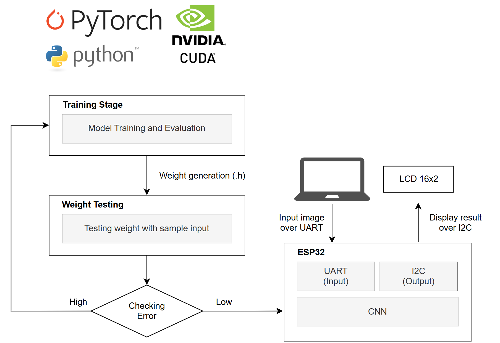
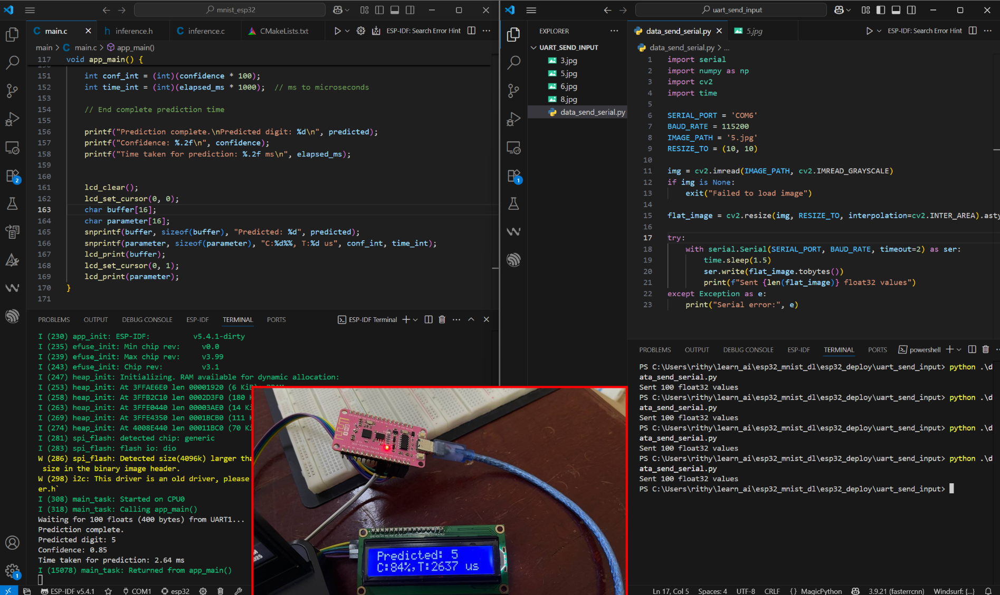

# CNN-Based Handwritten Digit Recognition on ESP32

This project implements a lightweight convolutional neural network (CNN) for handwritten digit recognition (0–9) on an **ESP32** microcontroller. The system processes input data received via **serial (UART)** and displays results on a 16x2 LCD. Key components include:

- A PyTorch-trained CNN model for digit classification
- ESP32 firmware for performing inference on 100 float inputs

## 1. Requirements and Setup

This project uses **ESP-IDF version 5.4.1** for the ESP32 and **Python 3.9.21** with the following dependencies:

```
numpy==1.26.4
opencv-python==4.7.0
pyserial==3.5
torch==2.0.1
torchvision==0.15.2
```


The MNIST dataset in JPG format can be downloaded from: [MNIST Dataset](https://nextcloud.sdu.dk/index.php/s/wZg4FLSxgiigJTL/download/MNIST_Dataset_JPG.zip).

### Setup Instructions
1. Install ESP-IDF version 5.4.1 following the [official documentation](https://docs.espressif.com/projects/esp-idf/en/v5.4.1/get-started/index.html).
2. Download and extract the MNIST dataset using the provided link.

## 2. System Overview

The following diagram illustrates the system workflow:



### Workflow
1. **Environment Setup**: Configure the Python environment and install the required packages.
2. **Model Training**: Train the CNN model using the PyTorch framework. Refer to the training script in [mnist_train/train.py](mnist_train/train.py).
3. **Weight Extraction**: Export the trained model weights as a C header file for ESP32 compatibility.
4. **Model Testing**: Load the header file into the testing code [mnist_test/test.c](mnist_test/test.c) to evaluate performance.
5. **ESP32 Deployment**: Integrate the weights into the ESP-IDF project workspace, located in [esp32_deploy/mnist_esp32](esp32_deploy/mnist_esp32), for inference on the ESP32.

## 3. Results

Detailed results and implementation steps are documented in the README files within each respective directory. The expected outcome of the deployment is shown below:



## 4. Directory Structure

- **[mnist_train/](mnist_train/)**: Contains the PyTorch training script (`train.py`) for the CNN model.
- **[mnist_test/](mnist_test/)**: Includes the C testing code (`test.c`) for model evaluation.
- **[esp32_deploy/](esp32_deploy/)**: Houses the ESP-IDF project for deploying the model on the ESP32.

## 5. Usage

1. Train the model by running the script in [mnist_train/train.py](mnist_train/train.py).
2. Generate the C header file containing the model weights.
3. Test the model using [mnist_test/test.c](mnist_test/test.c).
4. Build and flash the ESP-IDF project in [esp32_deploy/mnist_esp32](esp32_deploy/mnist_esp32) to the ESP32.
5. Send input data via UART to perform inference and view results on the 16x2 LCD.

## 6. Notes

- Ensure the ESP32 is properly configured with the ESP-IDF framework before deployment.
- Verify that the UART communication settings match between the Python script and ESP32 firmware.
- For additional details, refer to the README files in each subdirectory.